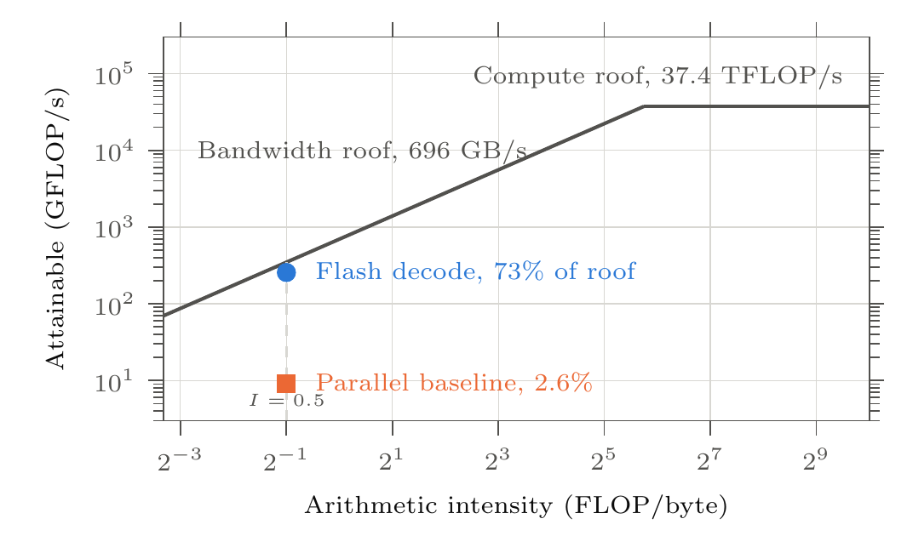
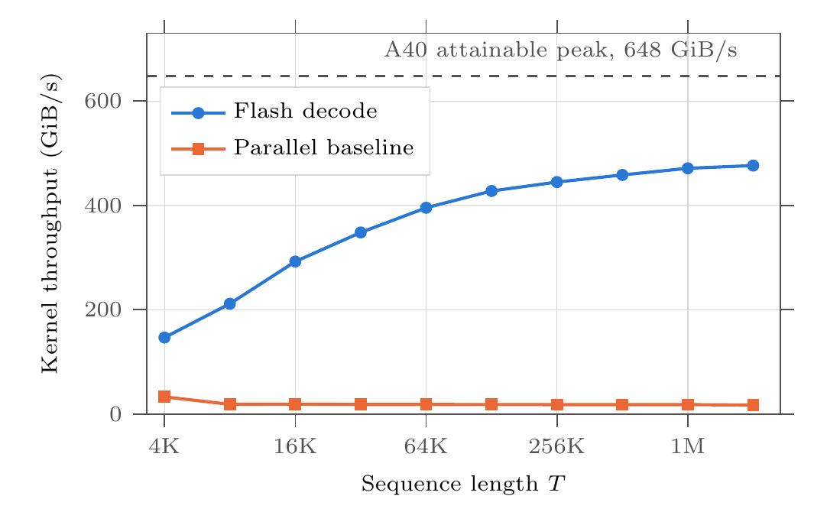
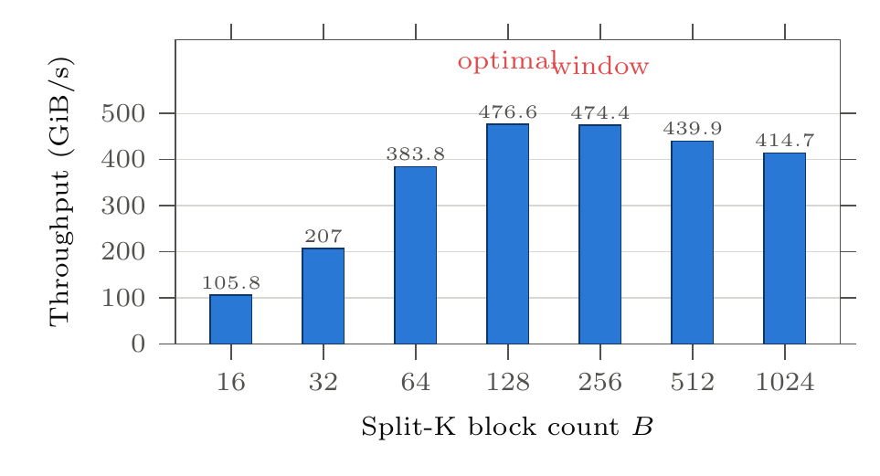
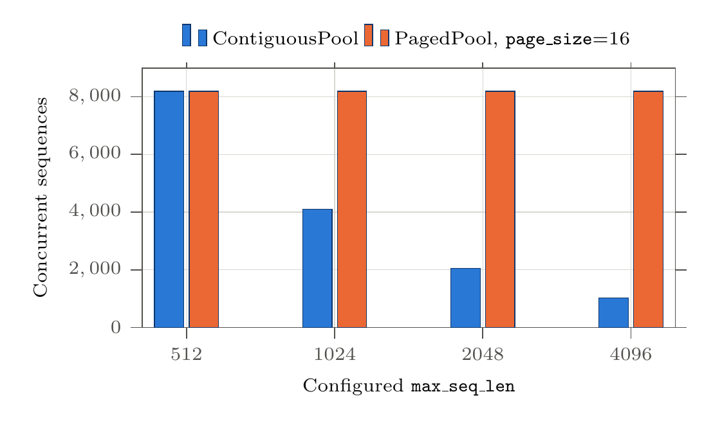
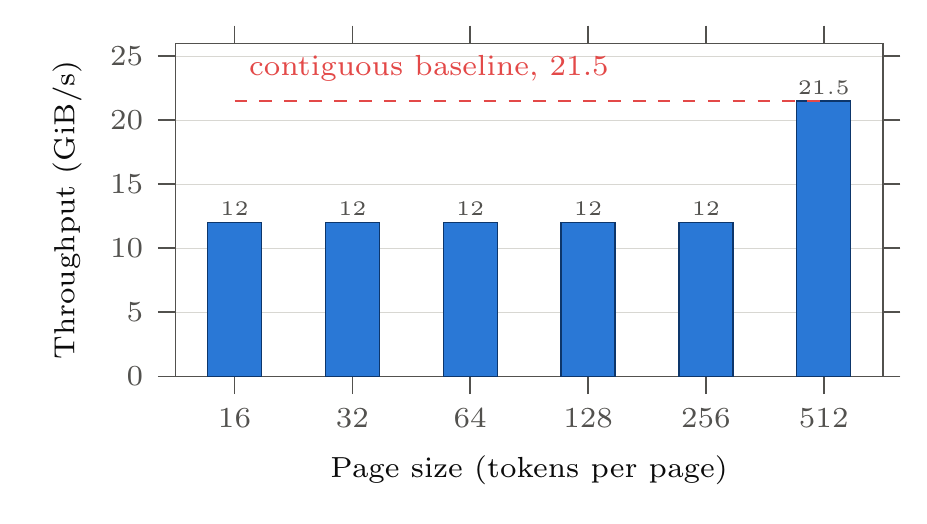
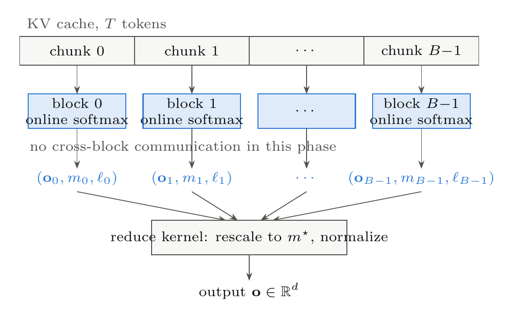
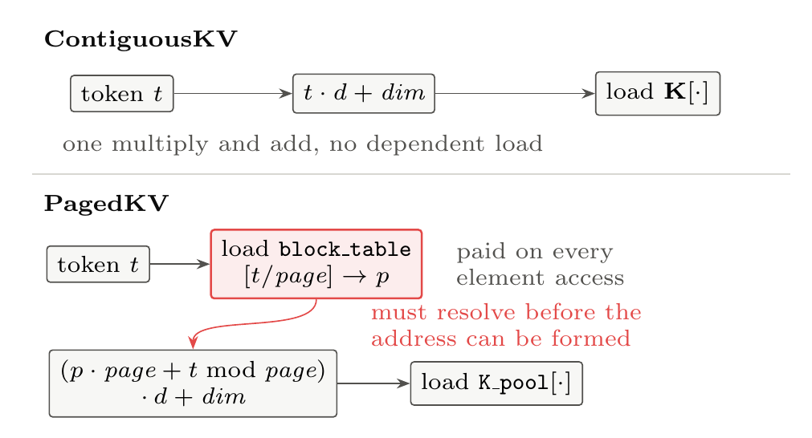
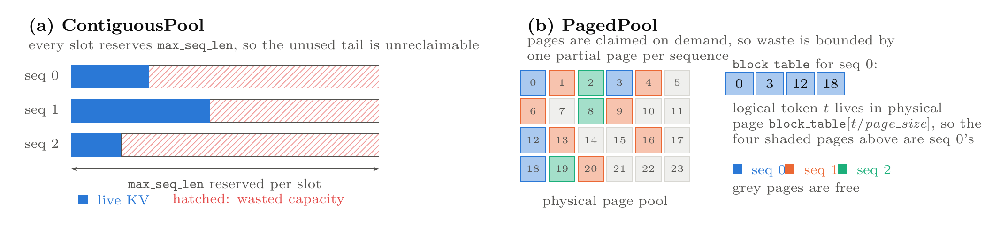

# Paged Attention

A from-scratch CUDA implementation of **flash decoding** and **PagedAttention** ([Kwon et al., SOSP 2023](https://arxiv.org/abs/2309.06180)), built to answer one question: *what does paged memory management actually cost at the kernel level?*

[](https://emaanheidari.com/decode_attention.pdf)


Emaan Heidari, Ara Esfarjani, Kamsi Nwabueze. University of Southern California.

## The short version

| | |
|---|---|
| Flash decode peak kernel throughput | **476 GiB/s**, 73% of the A40's attainable bandwidth |
| Speedup over a tuned parallel baseline | **28x** at `T = 2,097,152` |
| Concurrent sequences gained by paging | **4x** at 75% fragmentation, **8x** at 87% |
| Cost of paging | **1.79x** slower kernel, and completely flat across page sizes |

That last row is the interesting one. If the overhead came from crossing page boundaries, bigger pages would reduce it. It does not move at all between 16 and 256 tokens per page, which means the cost is paid on **every element access**, not once per page. Page size is therefore a pure capacity knob with no throughput consequence.

Throughput figures are binary rates (GiB/s), following Google Benchmark's convention. The A40's 696 GB/s of peak bandwidth is equivalently 648 GiB/s, and all comparisons use the latter.

## Why decode attention is a memory problem

During generation the query collapses to a single vector, so each decode step reads the entire KV cache to produce one token:

```
o = softmax(q Kᵀ / sqrt(d)) V        q is 1 x d,  K and V are T x d
```

That is roughly `4Td` floating point operations against roughly `8Td` bytes of traffic, so arithmetic intensity is **0.5 FLOP/byte**. The A40's ridge point is **53.7 FLOP/byte**. Decode attention sits two orders of magnitude to the left of the ridge, so the only headroom that exists is bandwidth headroom.

<p align="center">
  
</p>

## Results

### Kernel throughput at T = 2,097,152

<p align="center">
  
</p>

The baseline is not badly written. It uses tree reduction and coalesced access throughout. Its problem is structural: the softmax kernel runs on a single 128 thread block regardless of `T`, so it is an O(T) serial stage. Its throughput actually **falls** from 33 to 17 GiB/s as sequences grow, while flash decode climbs from 146 to 476.

### Split-K block count sweep

<p align="center">
  
</p>

Below 64 blocks there are too few blocks to occupy all 84 SMs. Above 256, chunks shrink below the size that sustains efficient memory transactions and the reduce kernel has more partials to merge.

### Capacity under fragmentation, 4 GB budget, actual_len = 512

<p align="center">
  
</p>

Contiguous capacity halves every time `max_seq_len` doubles, because every slot reserves the configured maximum whether or not the sequence uses it. Paged capacity does not move, because a sequence only ever holds the pages it has filled.

### Page size sweep, 64 sequences, actual_len = 512

<p align="center">
  
</p>

Perfectly flat. Only `page_size = 512` recovers the contiguous number, and only because one page then covers the whole sequence, removing the indirection entirely.

**Takeaway: pick the smallest page that keeps per sequence waste acceptable. There is no throughput penalty for doing so.**

## How it works

### Split-K flash decoding

Standard attention needs every score before it can normalize. Flash decoding breaks that dependency with an online softmax: each block keeps a running maximum and sum over its own chunk, so the partial results stay composable and no global barrier is needed during the parallel phase.

<p align="center">
  
</p>

### Where the paged overhead comes from

Both pools feed the same templated kernel, so memory layout is the only variable between them. The difference is entirely in how an address gets formed:

<p align="center">
  
</p>

For a kernel whose speed is decided purely by how fast it streams bytes, a stall sitting on the critical path converts directly into lost throughput. Because that block table load happens on every element access rather than once per page, its cost does not shrink when pages get bigger, which is exactly what the page size sweep shows.

### The memory layouts

<p align="center">
  
</p>

Both pools implement one interface, so the kernel never knows which is in use:

```cpp
class KVPool {
public:
  virtual int  admit(const float* K, const float* V, int len) = 0;
  virtual void release(int slot) = 0;
  virtual void append_token(int slot, int len,
                            const float* k, const float* v) = 0;
  virtual void decode(int slot, const float* q, float* out) = 0;
};
```

## Repository layout

```
src/attention/
  cpu/                 scalar reference, used as the correctness oracle
  naive_baseline/      three kernel pipeline: score, softmax, weighted sum
  flash_decode/        split-K partial kernel plus reduce kernel
  contiguous_pool/     fixed slot allocator
  paged_pool/          page allocator, free list, per slot block tables
include/
  kv_layout.hpp        ContiguousKV and PagedKV device accessors
  kv_pool.hpp          the shared KVPool interface
  attention_utils.hpp  input generation and comparison helpers
bench/
  bench_attention.cu   kernel and end to end throughput
  bench_pool.cu        capacity, page size, pool kernel comparison
  profile_flash.cu     standalone block count profiler
tests/                 GoogleTest suites for every kernel and both pools
docs/figures/          figures in this README, generated from the paper source
```

## Build and run

### 1. Get a GPU node

```bash
ssh <username>@discovery.usc.edu       # connect to vpn.usc.edu first
srun --account=snazaria_1817 --partition=gpu --gpus=a40:1 \
     --cpus-per-task=1 --mem=8G --pty bash
```

### 2. Build

```bash
git clone https://github.com/emaanh/paged-attention.git
cd paged-attention
source setup.sh
bash easy_build.sh
```

Rebuilding after editing files is just `cd build && make`. If you added or moved files, update `CMakeLists.txt` and re-run `cmake ..` first.

### 3. Run

```bash
./build/unit_tests                     # correctness, all kernels and both pools
./build/bench                          # attention kernel throughput
./build/bench_pool                     # pool benchmarks
./build/profile_flash [T] [blocks] [iters]
```

### Reproducing each result

| Result above | Command |
|---|---|
| Kernel and end to end throughput | `./build/bench` |
| Split-K block count sweep | `./build/profile_flash 2097152 128 100` |
| Contiguous vs paged kernel throughput | `./build/bench_pool --benchmark_filter=Kernel` |
| Capacity under fragmentation | `./build/bench_pool --benchmark_filter=BM_CapacityReport` |
| Page size sweep | `./build/bench_pool --benchmark_filter=BM_PagedPool_PageSizeSweep` |

## Correctness

Every GPU kernel is validated against the CPU reference for `d` in {8, 64, 128} and `T` in {4, 32, 256, 1024}, with maximum absolute error below `1e-4`. Pool tests cover admission, release, slot recycling, overflow, token append across page boundaries, and multi slot independence.

## Known limitations

These bound how far the numbers above generalize, and are stated in full in [the paper](https://emaanheidari.com/decode_attention.pdf).

- **The 1.79x is an upper bound.** The paged decode path copies the active block table host to device on every call, and the contiguous path has no equivalent transfer. Some of the gap is that copy rather than indirection.
- **Pages are handed out sequentially.** A sequence admitted into an empty pool receives physically consecutive pages, so both layouts present similar address streams. These measurements do not capture the locality loss a fragmented pool would cause.
- **Decode is serialized per sequence.** Production systems fuse all N sequences into one launch, which would amortize launch overhead that is included here.
- **FP32 only.** FP16 would halve the KV footprint and double effective bandwidth.
- **Single measurement runs.** No run to run variance is reported, so differences as small as the 0.5% between 128 and 256 blocks should not be treated as separable.

## References

- Kwon et al. [Efficient Memory Management for Large Language Model Serving with PagedAttention](https://arxiv.org/abs/2309.06180), SOSP 2023
- Dao et al. [FlashAttention](https://arxiv.org/abs/2205.14135), NeurIPS 2022
- Dao, Haziza, Massa, Sizov, [Flash-Decoding for long-context inference](https://crfm.stanford.edu/2023/10/12/flashdecoding.html), Stanford CRFM, 2023 (also on the [PyTorch blog](https://pytorch.org/blog/flash-decoding/))
- Milakov and Gimelshein, [Online normalizer calculation for softmax](https://arxiv.org/abs/1805.02867), 2018
- llama.cpp [issue #1955](https://github.com/ggml-org/llama.cpp/issues/1955), the PagedAttention feature request this work was built to inform
