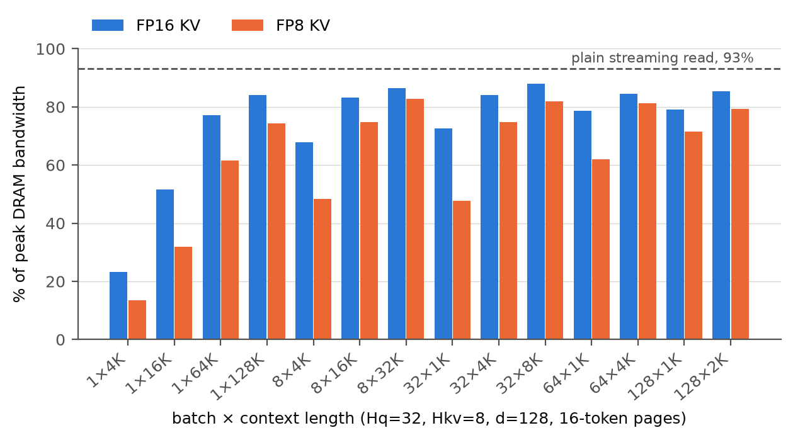
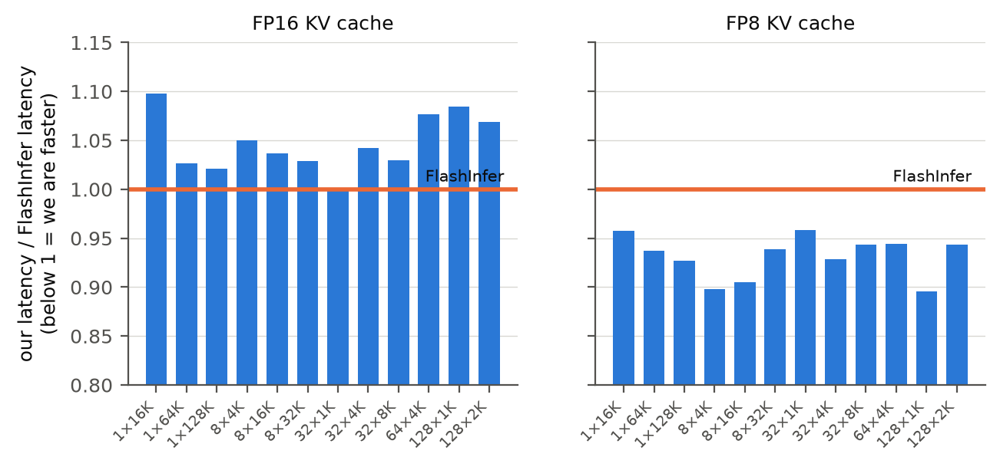
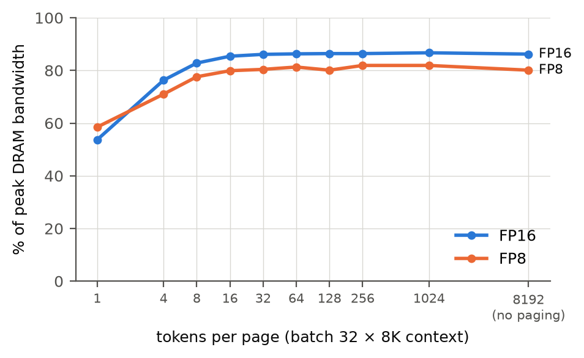
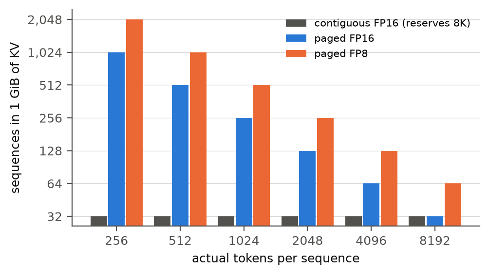

# Paged Attention

A paged flash-decoding kernel written from scratch in C++ and CUDA. It does split-KV decoding with online softmax, runs GQA on tensor cores, does the page-table lookup inside the load, and can store the KV cache in FP8. On an H100 it's within a few percent of FlashInfer.

### [Read the paper (PDF)](https://emaanheidari.com/decode_attention.pdf)


Emaan Heidari, Ara Esfarjani, Kamsi Nwabueze. University of Southern California.

## The short version

| | |
|---|---|
| DRAM bandwidth, FP16 KV | **86%** of peak (Nsight Compute) |
| DRAM bandwidth, FP8 KV | **83%** of peak |
| vs FlashInfer, FP16 | FlashInfer is **4%** faster (median) |
| vs FlashInfer, FP8 | ours is **7%** faster (median) |
| FP8 KV cache | half the memory, **2x** the sequences, **1.86x** faster than FP16 |
| Cost of paging | **under 1%** |

The paging row is what this project was originally about. Our first version (FP32, on an A40) paid 1.79x for paging because every element read went through the block table. Now each page is looked up once per 16-byte load, inside the async copy pipeline, and the cost basically disappears.

Everything is measured on one Llama-3-8B attention layer (32 query heads, 8 KV heads, head dim 128) with 16-token pages scattered randomly through memory.

## Why decode is a memory problem

Each new token attends over the whole KV cache:

```
o = softmax(q Kᵀ / sqrt(d)) V
```

Every K and V value gets read once and used for a couple of multiply-adds. That's about 4 FLOP per byte, and the H100 can do about 295 before it runs out of bandwidth. So the kernel is only as fast as it can stream the cache out of DRAM, and that's the number that matters.

## Results

### Bandwidth

<p align="center">
  
</p>

On anything reasonably large (4K+ context, 100+ MB of KV), FP16 sits at 83 to 88% of peak and FP8 at 75 to 83%. A plain memory read tops out at 93%, so there isn't much left. Small problems are slower because launch and pipeline startup take longer than the actual work.

FP8 is a few points lower because each byte holds twice as many tokens, so there's twice as much math per byte.

### Against FlashInfer

<p align="center">
  
</p>

Both kernels read the exact same cache and block table, and are timed the same way (cold L2, median of 3 × 50 runs). We ran both of FlashInfer's decode paths and kept whichever was faster. The outputs match to 2.5e-4.

FlashInfer wins on FP16, mostly at batch 64 to 128. We win on FP8 on every shape.

### Page size

<p align="center">
  
</p>

The 8K point is one page per sequence, which is just a contiguous layout. From 16 tokens per page up, paging costs less than 1%. Below 8 tokens the lookups start to add up.

### Capacity

<p align="center">
  
</p>

A contiguous cache reserves the full 8K context for every sequence. Paging only allocates what's used, and FP8 halves that again. At a 2K average length, 1 GiB holds 32 sequences contiguous, 128 paged, and 256 paged in FP8. These come from actually running the allocator until it's full.

### FP8 accuracy

FP8 (E4M3, one scale per tensor) changes the output by about 3.8% relative to the FP16 cache. That's just what 3-bit mantissas cost. Per-head scales would help but aren't implemented.

## How it works

**Split-KV with online softmax.** A sequence's tokens are spread across many thread blocks, each keeping a running max and sum. A small merge kernel combines the pieces at the end.

**Persistent schedule.** Instead of one block per chunk (which leaves a half-empty last wave), the host plans the work up front: all (sequence, head, tile) work is cut into equal ranges, one per block, in a single wave. Ranges can span sequences, and the pipeline keeps prefetching across them. The plan is built once per decode step and reused for every layer.

**GQA on tensor cores.** The query heads that share a KV head become rows of one `mma.sync`, so each K/V fragment is read once for the whole group. Both QKᵀ and PV run on tensor cores. The shared memory layout is swizzled so the loads don't hit bank conflicts.

**Fused page lookup.** The block table lives on the GPU. Each 16-byte async copy finds its own page while computing its address:

```cpp
const int page = __ldg(block_table + token / page_size);
const size_t src = page * page_stride + kv_head * head_stride
                 + (token % page_size) * row_bytes + chunk * 16;
cp_async_16(smem_dst, kv_base + src, token < end);
```

**FP8.** Tokens are quantized when they're appended. The kernel loads the FP8 bytes through the same pipeline and converts them to FP16 in registers right before the matmul.

## Layout

```
src/decode/          the H100 kernel, scheduler, and paged KV cache
bindings/            PyTorch extension (for the FlashInfer comparison)
bench/               benchmarks
scripts/             Modal runner, FlashInfer comparison, figure generation
tests/               GoogleTest suites
results/             raw CSVs behind every number here
src/attention/       the original FP32 A40 code
```

## Build and run

On Modal (where the numbers came from):

```bash
pip install modal && modal setup
modal run scripts/modal_run.py --cmd "./build/decode_tests"
modal run scripts/modal_run.py --cmd "./build/bench_decode sweep"
```

Set `GPU=H200` or similar to use a different card.

Locally (needs CUDA 12.4+, CMake 3.29+, sm_80 or newer):

```bash
git clone https://github.com/emaanh/paged-attention.git
cd paged-attention
cmake -B build -DCMAKE_BUILD_TYPE=Release && cmake --build build -j
./build/decode_tests
```

To reproduce the results:

| Result | Command |
|---|---|
| Bandwidth | `./build/bench_decode sweep` |
| vs FlashInfer, FP8 accuracy | `python scripts/compare_flashinfer.py --repeats 3` |
| Page size | `./build/bench_decode pagesize --batch 32 --len 8192` |
| Capacity | `./build/bench_decode capacity --budget-gib 1` |
| Nsight | `ncu --clock-control none --metrics dram__throughput.avg.pct_of_peak_sustained_elapsed ./build/bench_decode single --iters 1` |

## Testing

The tests check the kernel against a CPU reference across FP16 and FP8, GQA group sizes 1 to 8, page sizes 1 to 128, mixed batch lengths, scattered pages, and 32K-token sequences. The original 33 FP32 tests still pass too.

## Where this started

This began as a class project on an A40 measuring what paging costs. That version hit 73% of bandwidth and found paging cost 1.79x. The code is still in `src/attention/`. This version is the follow-up that gets rid of that cost.

## Limitations

- Head dim 128 only (covers Llama, Mistral, Qwen).
- Decode only, no prefill.
- FP16 is 7 to 8% behind FlashInfer at batch 64 to 128.
- Only tested on one H100. Runs vary by 2 to 3%.

## References

- Kwon et al. [PagedAttention](https://arxiv.org/abs/2309.06180), SOSP 2023
- Dao et al. [FlashAttention](https://arxiv.org/abs/2205.14135), NeurIPS 2022
- Dao et al. [Flash-Decoding](https://crfm.stanford.edu/2023/10/12/flashdecoding.html), 2023
- Ye et al. [FlashInfer](https://arxiv.org/abs/2501.01005), MLSys 2025
- Ainslie et al. [GQA](https://arxiv.org/abs/2305.13245), EMNLP 2023
- Osama et al. [Stream-K](https://arxiv.org/abs/2301.03598), PPoPP 2023
- Micikevicius et al. [FP8 Formats for Deep Learning](https://arxiv.org/abs/2209.05433), 2022
- Milakov and Gimelshein, [Online softmax](https://arxiv.org/abs/1805.02867), 2018
